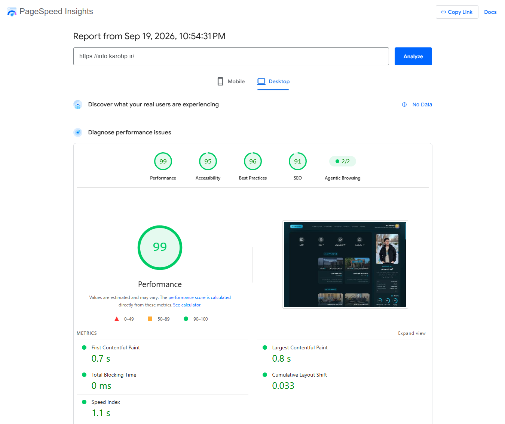
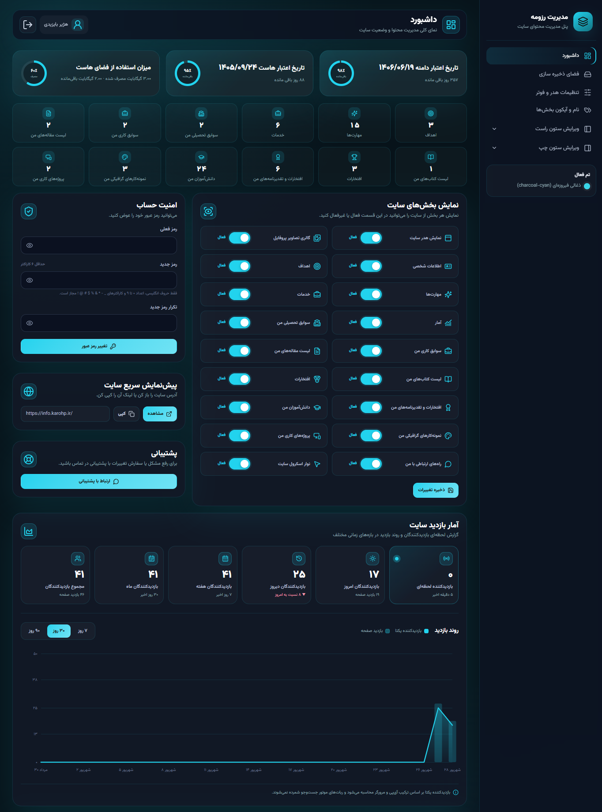
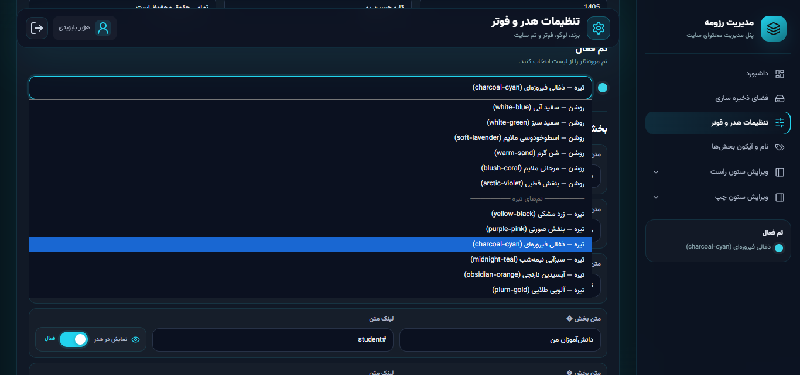
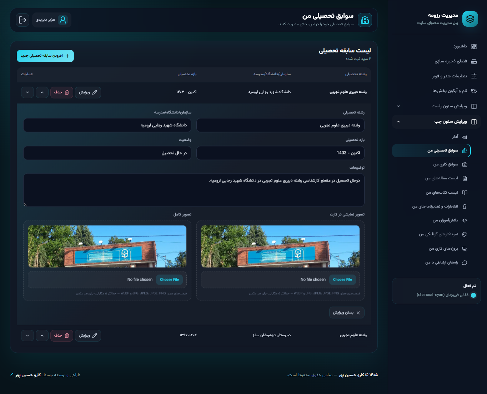
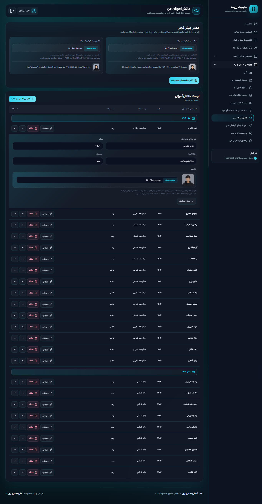

# Professional-Personal-Resume-Site

یک **وب‌سایت رزومه و پرتفولیو حرفه‌ای، مدرن و کاملاً قابل مدیریت** با PHP و MySQL که علاوه بر نمایش اطلاعات شخصی، سوابق، مهارت‌ها و نمونه‌کارها، دارای یک **پنل مدیریت قدرتمند و اختصاصی** برای مدیریت کامل محتوای سایت است.

این پروژه به‌گونه‌ای طراحی شده که تقریباً تمام بخش‌های محتوایی سایت بدون نیاز به ویرایش مستقیم کد، از طریق **پنل مدیریت اختصاصی** قابل کنترل و بروزرسانی باشند.



---

# 🟢 سایت‌های فعال
https://karohp.ir

https://mehrzadab.ir

---

# 🌐 امکانات سایت اصلی

## 👤 پروفایل حرفه‌ای

* نمایش اطلاعات اصلی پروفایل
* نام و عنوان شغلی
* معرفی و توضیحات شخصی
* تصاویر پروفایل
* اطلاعات شخصی قابل مدیریت
* لوگو و آیکون قابل تنظیم
* عنوان و برند سایت قابل تغییر

## 🎯 اهداف و مهارت‌ها

### اهداف

* نمایش اهداف حرفه‌ای
* نمایش درصد پیشرفت هر هدف
* مدیریت ترتیب نمایش اهداف
* فعال یا غیرفعال کردن اهداف

### مهارت‌ها

* ثبت مهارت‌های مختلف
* نمایش درصد تسلط
* آیکون اختصاصی برای هر مهارت
* امکان تغییر ترتیب مهارت‌ها
* فعال / غیرفعال کردن مهارت‌ها

## 💼 خدمات

بخش اختصاصی برای معرفی خدمات قابل ارائه:

* ایجاد خدمات جدید
* ویرایش خدمات
* حذف خدمات
* فعال / غیرفعال کردن خدمات
* مدیریت ترتیب نمایش

# 🎓 سوابق تحصیلی و کاری

سیستم مدیریت سوابق به صورت جداگانه برای:

* **سوابق تحصیلی**
* **سوابق کاری**

طراحی شده است.

برای هر سابقه امکان مدیریت مواردی مانند:

* عنوان
* سازمان / دانشگاه / مدرسه
* بازه زمانی
* توضیحات
* تصویر
* تصویر کامل
* وضعیت نمایش
* ترتیب نمایش

وجود دارد.

# 📰 مقالات

یک بخش کامل برای نمایش و مدیریت مقالات:

* عنوان مقاله
* تاریخ
* نوع مقاله
* توضیحات نمایشی کارت
* چکیده مقاله
* نویسنده / نویسندگان
* کلیدواژه‌ها
* تعداد صفحات
* تصویر نمایشی کارت
* تصویر کامل
* لینک خرید / دانلود
* وضعیت نمایش
* ترتیب نمایش

### 📚 کتاب‌ها

سیستم مدیریت کتاب نیز در کنار مقالات قرار گرفته و امکان ثبت و نمایش:

* عنوان کتاب
* تاریخ
* نوع انتشار
* نویسنده
* توضیحات
* ناشر
* تعداد صفحات
* تصاویر
* لینک خرید / دانلود
* ترتیب نمایش

را فراهم می‌کند.

# 🏆 افتخارات و گواهی‌ها

بخش اختصاصی برای معرفی دستاوردهای حرفه‌ای:

### 🏅 افتخارات

* عنوان افتخار
* مدیریت وضعیت نمایش
* مدیریت ترتیب

### 📜 گواهی‌ها و تقدیرنامه‌ها

* عنوان گواهی
* توضیحات
* تصویر نمایشی
* تصویر کامل
* وضعیت نمایش
* ترتیب نمایش

این بخش برای نمایش **تقدیرنامه‌ها، مقام‌ها، افتخارات و مدارک حرفه‌ای** طراحی شده است.

# 👨‍🎓 دانش‌آموزان

یک سیستم اختصاصی برای نمایش دانش‌آموزان:

* نام و نام خانوادگی
* سال
* رشته / پایه
* جنسیت
* تصویر دانش‌آموز
* تصویر پیش‌فرض پسران
* تصویر پیش‌فرض دختران
* مدیریت ترتیب نمایش
* مدیریت وضعیت نمایش

دانش‌آموزان بر اساس **سال** مدیریت و نمایش می‌شوند.

# 🎨 نمونه‌کارهای گرافیکی

بخش اختصاصی برای نمایش نمونه کارهای گرافیکی:

* تصویر نمونه‌کار
* تصویر کامل نمونه‌کار
* عنوان / متن جایگزین
* وضعیت نمایش
* ترتیب نمایش

مناسب برای نمایش:

**طراحی‌های گرافیکی، آثار هنری، پوسترها، طرح‌ها و پروژه‌های تصویری.**

# 💻 پروژه‌های من

بخش اختصاصی برای معرفی پروژه‌های طراحی و توسعه سایت:

* نام پروژه
* عنوان پروژه
* توضیحات
* وضعیت پروژه
* تصویر پروژه
* لینک پروژه
* متن لینک
* وضعیت نمایش
* ترتیب نمایش

این بخش می‌تواند به عنوان یک **نمونه کارهای اختصاصی برای پروژه‌های وب و نرم‌افزاری** مورد استفاده قرار گیرد.

# 🔗 راه‌های ارتباطی

بخش اختصاصی برای مدیریت شبکه‌های اجتماعی و راه‌های ارتباطی:

* شناسه / آیدی
* لینک
* وضعیت نمایش
* ترتیب نمایش

بدون نیاز به تغییر مستقیم کد سایت، اطلاعات ارتباطی از پنل مدیریت قابل کنترل است.

# 📊 آمار بازدید سایت

یکی از قابلیت‌های مهم پروژه، **سیستم ثبت و تحلیل بازدید سایت** است.

سیستم بازدید امکاناتی مانند:

* ثبت بازدیدکنندگان
* ثبت IP
* ثبت User-Agent
* ثبت صفحه بازدیدشده
* ثبت Referrer
* ثبت تاریخ و ساعت بازدید
* ایجاد شناسه Hash برای بازدیدکننده
* جلوگیری از ثبت چندباره بازدید در فاصله کوتاه
* حذف ربات‌ها و خزنده‌ها از آمار
* پاک‌سازی خودکار اطلاعات قدیمی

را دارد.

اطلاعات بازدید در پنل مدیریت به صورت **گزارش و نمودار** قابل مشاهده است.


# 🎨 سیستم تم و ظاهر سایت

سایت دارای چندین تم رنگی آماده است و ظاهر بخش‌های مختلف می‌تواند بر اساس تم انتخاب‌شده تغییر کند.

تم‌های موجود شامل تم‌های تیره و روشن:

*  Yellow Black
*  White Blue
*  White Green
*  Purple Pink
*  Charcoal Cyan
*  Soft Lavender
*  Warm Sand
*  Midnight Teal
*  Blush Coral
*  Arctic Violet
*  Obsidian Orange
*  Plum Gold

### ✨ امکانات ظاهری

* طراحی مدرن
* رابط کاربری شیشه‌ای
* Gradient Background
* انیمیشن‌های نرم
* افکت‌های Hover
* طراحی RTL
* فونت فارسی Vazirmatn
* طراحی Responsive
* سازگاری با موبایل و دسکتاپ
* منوی واکنش‌گرا
* اسکرول نرم
* آیکون‌های مدرن با Lucide

---

# 📱 طراحی Responsive

سایت برای نمایش صحیح در:

* 🖥 دسکتاپ
* 💻 لپ‌تاپ
* 📱 موبایل
* 📟 تبلت

طراحی شده است.

تمام بخش‌های اصلی سایت و پنل مدیریت دارای ساختار ریسپانسیو هستند.

---

# ⚙️ پنل مدیریت حرفه‌ای

قلب اصلی پروژه، **Admin Panel اختصاصی** آن است.

پنل مدیریت شامل بخش‌های زیر است:

* 📊 داشبورد
* 💾 فضای ذخیره‌سازی
* 🖼 تنظیمات هدر و فوتر
* 🧩 نام و آیکون بخش‌ها
* ⚙️ مدیریت بخش‌های سایت
* 👤 پروفایل
* 🖼 تصاویر پروفایل
* 🪪 اطلاعات شخصی
* 🎯 اهداف
* ⚡ مهارت‌ها
* 💼 خدمات
* 📈 آمار
* 🎓 سوابق
* 📰 مقالات و کتاب‌ها
* 🏆 افتخارات
* 📜 گواهی‌ها
* 👨‍🎓 دانش‌آموزان
* 🎨 نمونه‌کارهای گرافیکی
* 💻 پروژه‌های سایت
* 🔗 راه‌های ارتباطی

ساختار این بخش‌ها مستقیماً در پنل پروژه پیاده‌سازی شده است.

---

# 💾 فضای ذخیره‌سازی هاست

یکی از قابلیت‌های کاربردی پنل، **فضای ابری و اختصاصی سایت** است.

مدیر می‌تواند فایل‌های مختلف را مستقیماً از داخل پنل مدیریت کند.

### 📁 امکانات

* آپلود فایل
* مشاهده فایل‌های ذخیره‌شده
* تغییر نام فایل
* حذف فایل
* نمایش حجم فایل
* نمایش نوع فایل
* نمایش آیکون متناسب با نوع فایل
* بررسی فضای آزاد هاست
فایل‌ها در پوشه اختصاصی `files` مدیریت می‌شوند و حذف فایل نیز مستقیماً از روی هاست انجام می‌شود.

---

# 📝 سیستم ثبت لاگ عملیات ادمین

یکی از ویژگی‌های مهم پنل، **ثبت دقیق فعالیت کاربران مدیریتی** است.

سیستم می‌تواند تغییرات واقعی انجام‌شده توسط ادمین را شناسایی و ثبت کند.

برای مثال:

* افزودن یک مورد جدید
* حذف یک مورد
* تغییر عنوان
* تغییر وضعیت نمایش
* تغییر ترتیب
* تغییر تصویر
* تغییر اطلاعات
* تغییر تنظیمات
* تغییر رمز عبور
* آپلود فایل
* حذف فایل
* تغییر نام فایل

و تغییرات را به شکل قابل فهم در لاگ ثبت می‌کند.

---

# 🔄 مدیریت ترتیب محتوا

بخش‌های مختلف سایت دارای سیستم مدیریت ترتیب نمایش هستند.

امکان:

* جابه‌جایی آیتم‌ها
* تغییر ترتیب
* ذخیره ترتیب جدید
* نمایش محتوا بر اساس ترتیب تعیین‌شده

در بخش‌های مختلف مانند:

**مهارت‌ها، خدمات، اهداف، سوابق، مقالات، کتاب‌ها، افتخارات، گواهی‌ها، دانش‌آموزان، نمونه‌کارها و پروژه‌ها**

وجود دارد.

---

# 🖼 مدیریت تصاویر

پروژه دارای سیستم مدیریت تصاویر برای بخش‌های مختلف است.

از جمله:

* لوگو
* Favicon
* تصاویر پروفایل
* تصاویر سوابق
* تصاویر مقالات
* تصاویر کتاب‌ها
* تصاویر گواهی‌ها
* تصاویر دانش‌آموزان
* تصاویر نمونه‌کارها
* تصاویر پروژه‌ها

همچنین برای برخی تصاویر، نسخه **Thumbnail / Full Image** به صورت جداگانه قابل مدیریت است.

---

# 🛠 تکنولوژی‌های استفاده‌شده

### Backend

* PHP
* MySQL
* PDO
* Session Management

### Frontend

* HTML5
* CSS3
* JavaScript
* Bootstrap 5 RTL
* Lucide Icons

### UI / UX

* Responsive Design
* Glassmorphism
* Gradient UI
* Animated Background
* Smooth Scrolling
* RTL Layout
* Persian Typography
* Vazirmatn

---
# 🎯 مناسب برای چه کسانی است؟

این پروژه می‌تواند برای ساخت وب‌سایت شخصی افراد مختلف استفاده شود:

* 👨‍💻 برنامه‌نویسان
* 🎨 طراحان گرافیک
* 🧑‍🏫 مدرس‌ها و معلمان
* 🎓 دانشجویان
* 👨‍🔬 پژوهشگران
* 💼 فریلنسرها
* 🏢 متخصصان و صاحبان کسب‌وکار
* 📚 نویسندگان
* 🧑‍💼 افراد دارای رزومه حرفه‌ای

---

# 🌟 نقاط برجسته پروژه

| قابلیت                     | وضعیت |
| -------------------------- | ----- |
| 🌐 سایت رزومه و Portfolio  | ✅     |
| 🎨 طراحی مدرن و Responsive | ✅     |
| 📱 سازگاری با موبایل       | ✅     |
| 👤 مدیریت پروفایل          | ✅     |
| 🎯 مدیریت اهداف            | ✅     |
| ⚡ مدیریت مهارت‌ها          | ✅     |
| 💼 مدیریت خدمات            | ✅     |
| 🎓 سوابق تحصیلی و کاری     | ✅     |
| 📰 مدیریت مقالات           | ✅     |
| 📚 مدیریت کتاب‌ها          | ✅     |
| 🏆 مدیریت افتخارات         | ✅     |
| 📜 مدیریت گواهی‌ها         | ✅     |
| 👨‍🎓 مدیریت دانش‌آموزان   | ✅     |
| 🎨 Portfolio گرافیکی       | ✅     |
| 💻 Portfolio پروژه‌های وب  | ✅     |
| 🔗 مدیریت راه‌های ارتباطی  | ✅     |
| 📊 آمار بازدید             | ✅     |
| 💾 File Manager            | ✅     |
| 📝 ثبت لاگ عملیات          | ✅     |
| 🔐 CSRF Protection         | ✅     |
| 🎨 چندین تم رنگی           | ✅     |
| 🖼 مدیریت تصاویر           | ✅     |
| 🔄 مدیریت ترتیب محتوا      | ✅     |

---

# 📸 تصاویر محیط پروژه

### 🌐 صفحه اصلی


### 📊 داشبورد ادمین


### 🎨 تم های سایت


### 📰 سوابق کاری


### 🎓 دانش آموزان


---

# 👨‍💻 توسعه‌دهنده

**کارو حسین پور**
🌐 Website:

```text
https://Karohp.ir
```

---

# 🚀 نصب و راه‌اندازی

## 1️⃣ برای دریافت سایت و پنل به صورت مادام العمر یا زماندار از طریق لینک زیر با بنده در ارتباط باشید.
https://karohp.ir/#contact
---

# 📄 License

این پروژه به صورت اختصاصی طراحی شده و فایل اوپن سورس در هیچ جایی قرار نمی‌گیرد. جهت تهیه سایت با توسعه دهنده در ارتباط باشید.
