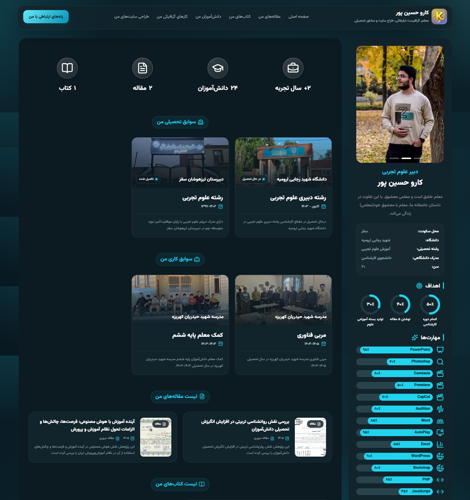

# Professional-Personal-Resume-Site

یک **وب‌سایت رزومه و پرتفولیو حرفه‌ای، مدرن و کاملاً قابل مدیریت** با PHP و MySQL که علاوه بر نمایش اطلاعات شخصی، سوابق، مهارت‌ها و نمونه‌کارها، دارای یک **پنل مدیریت قدرتمند و اختصاصی** برای مدیریت کامل محتوای سایت است.

این پروژه به‌گونه‌ای طراحی شده که تقریباً تمام بخش‌های محتوایی سایت بدون نیاز به ویرایش مستقیم کد، از طریق **پنل مدیریت اختصاصی** قابل کنترل و بروزرسانی باشند.

---

# ✨ معرفی پروژه

این پروژه یک **Personal Portfolio / Resume Website** پیشرفته است که برای معرفی حرفه‌ای فرد، سوابق تحصیلی و کاری، مهارت‌ها، خدمات، مقالات، کتاب‌ها، افتخارات، گواهی‌ها، دانش‌آموزان، نمونه‌کارهای گرافیکی و پروژه‌های طراحی سایت ساخته شده است.

در کنار سایت اصلی، یک **پنل مدیریت اختصاصی** قرار دارد که امکان مدیریت و بروزرسانی بخش‌های مختلف سایت را فراهم می‌کند.

### ⭐ ویژگی برجسته پروژه

> **محتوای سایت از طریق پنل مدیریت کنترل می‌شود و برای تغییر بخش‌های مختلف نیازی به ویرایش مستقیم فایل‌های Front-End نیست.**

---

# 🌐 امکانات سایت اصلی

## 👤 پروفایل حرفه‌ای

* نمایش اطلاعات اصلی پروفایل
* نام و عنوان شغلی
* معرفی و توضیحات شخصی
* تصاویر پروفایل
* اطلاعات شخصی قابل مدیریت
* لوگو و Favicon قابل تنظیم
* عنوان و برند سایت قابل تغییر

---

## 🎯 اهداف و مهارت‌ها

### اهداف

* نمایش اهداف حرفه‌ای
* نمایش درصد پیشرفت هر هدف
* مدیریت ترتیب نمایش اهداف
* فعال یا غیرفعال کردن اهداف

### مهارت‌ها

* ثبت مهارت‌های مختلف
* نمایش درصد تسلط
* آیکون اختصاصی برای هر مهارت
* امکان تغییر ترتیب مهارت‌ها
* فعال / غیرفعال کردن مهارت‌ها

---

## 💼 خدمات

بخش اختصاصی برای معرفی خدمات قابل ارائه:

* ایجاد خدمات جدید
* ویرایش خدمات
* حذف خدمات
* فعال / غیرفعال کردن خدمات
* مدیریت ترتیب نمایش

---

# 🎓 سوابق تحصیلی و کاری

سیستم مدیریت سوابق به صورت جداگانه برای:

* **سوابق تحصیلی**
* **سوابق کاری**

طراحی شده است.

برای هر سابقه امکان مدیریت مواردی مانند:

* عنوان
* سازمان / دانشگاه / مدرسه
* بازه زمانی
* توضیحات
* تصویر
* تصویر کامل
* وضعیت نمایش
* ترتیب نمایش

وجود دارد.

---

# 📰 مقالات

یک بخش کامل برای نمایش و مدیریت مقالات:

* عنوان مقاله
* تاریخ
* نوع مقاله
* توضیحات نمایشی کارت
* چکیده مقاله
* نویسنده / نویسندگان
* کلیدواژه‌ها
* تعداد صفحات
* تصویر نمایشی کارت
* تصویر کامل
* لینک خرید / دانلود
* وضعیت نمایش
* ترتیب نمایش

### 📚 کتاب‌ها

سیستم مدیریت کتاب نیز در کنار مقالات قرار گرفته و امکان ثبت و نمایش:

* عنوان کتاب
* تاریخ
* نوع انتشار
* نویسنده
* توضیحات
* ناشر
* تعداد صفحات
* تصاویر
* لینک خرید / دانلود
* ترتیب نمایش

را فراهم می‌کند.

---

# 🏆 افتخارات و گواهی‌ها

بخش اختصاصی برای معرفی دستاوردهای حرفه‌ای:

### 🏅 افتخارات

* عنوان افتخار
* مدیریت وضعیت نمایش
* مدیریت ترتیب

### 📜 گواهی‌ها و تقدیرنامه‌ها

* عنوان گواهی
* توضیحات
* تصویر نمایشی
* تصویر کامل
* وضعیت نمایش
* ترتیب نمایش

این بخش برای نمایش **تقدیرنامه‌ها، مقام‌ها، افتخارات و مدارک حرفه‌ای** طراحی شده است.

---

# 👨‍🎓 دانش‌آموزان

یک سیستم اختصاصی برای نمایش دانش‌آموزان:

* نام و نام خانوادگی
* سال
* رشته / پایه
* جنسیت
* تصویر دانش‌آموز
* تصویر پیش‌فرض پسران
* تصویر پیش‌فرض دختران
* مدیریت ترتیب نمایش
* مدیریت وضعیت نمایش

دانش‌آموزان بر اساس **سال** مدیریت و نمایش می‌شوند.

---

# 🎨 نمونه‌کارهای گرافیکی

بخش اختصاصی برای نمایش Portfolio گرافیکی:

* تصویر نمونه‌کار
* تصویر کامل نمونه‌کار
* عنوان / متن جایگزین
* وضعیت نمایش
* ترتیب نمایش

مناسب برای نمایش:

**طراحی‌های گرافیکی، آثار هنری، پوسترها، طرح‌ها و پروژه‌های تصویری.**

---

# 💻 پروژه‌های من

بخش اختصاصی برای معرفی پروژه‌های طراحی و توسعه سایت:

* نام پروژه
* عنوان پروژه
* توضیحات
* وضعیت پروژه
* تصویر پروژه
* لینک پروژه
* متن لینک
* وضعیت نمایش
* ترتیب نمایش

این بخش می‌تواند به عنوان یک **Portfolio اختصاصی برای پروژه‌های وب و نرم‌افزاری** مورد استفاده قرار گیرد.

---

# 🔗 راه‌های ارتباطی

بخش اختصاصی برای مدیریت شبکه‌های اجتماعی و راه‌های ارتباطی:

* شناسه / ID
* لینک
* وضعیت نمایش
* ترتیب نمایش

بدون نیاز به تغییر مستقیم کد سایت، اطلاعات ارتباطی از پنل مدیریت قابل کنترل است.

---

# 📊 آمار بازدید سایت

یکی از قابلیت‌های مهم پروژه، **سیستم ثبت و تحلیل بازدید سایت** است.

سیستم بازدید امکاناتی مانند:

* ثبت بازدیدکنندگان
* ثبت IP
* ثبت User-Agent
* ثبت صفحه بازدیدشده
* ثبت Referrer
* ثبت تاریخ و ساعت بازدید
* ایجاد شناسه Hash برای بازدیدکننده
* جلوگیری از ثبت چندباره بازدید در فاصله کوتاه
* حذف ربات‌ها و خزنده‌ها از آمار
* پاک‌سازی خودکار اطلاعات قدیمی

را دارد.

اطلاعات بازدید در پنل مدیریت به صورت **گزارش و نمودار** قابل مشاهده است.

---

# 🎨 سیستم تم و ظاهر سایت

سایت دارای چندین تم رنگی آماده است و ظاهر بخش‌های مختلف می‌تواند بر اساس تم انتخاب‌شده تغییر کند.

تم‌های موجود شامل:

* 🟡 Yellow Black
* 🔵 White Blue
* 🟢 White Green
* 🟣 Purple Pink
* 🌊 Charcoal Cyan
* 💜 Soft Lavender
* 🟤 Warm Sand
* 🟦 Midnight Teal
* 🌸 Blush Coral
* 🟪 Arctic Violet
* 🟠 Obsidian Orange
* 🟨 Plum Gold

### ✨ امکانات ظاهری

* طراحی مدرن
* رابط کاربری شیشه‌ای
* Gradient Background
* انیمیشن‌های نرم
* افکت‌های Hover
* طراحی RTL
* فونت فارسی Vazirmatn
* طراحی Responsive
* سازگاری با موبایل و دسکتاپ
* منوی واکنش‌گرا
* اسکرول نرم
* آیکون‌های مدرن با Lucide

---

# 📱 طراحی Responsive

سایت برای نمایش صحیح در:

* 🖥 دسکتاپ
* 💻 لپ‌تاپ
* 📱 موبایل
* 📟 تبلت

طراحی شده است.

تمام بخش‌های اصلی سایت و پنل مدیریت دارای ساختار Responsive هستند.

---

# ⚙️ پنل مدیریت حرفه‌ای

قلب اصلی پروژه، **Admin Panel اختصاصی** آن است.

پنل مدیریت شامل بخش‌های زیر است:

* 📊 داشبورد
* 💾 فضای ذخیره‌سازی
* 🖼 تنظیمات هدر و فوتر
* 🧩 نام و آیکون بخش‌ها
* ⚙️ مدیریت بخش‌های سایت
* 👤 پروفایل
* 🖼 تصاویر پروفایل
* 🪪 اطلاعات شخصی
* 🎯 اهداف
* ⚡ مهارت‌ها
* 💼 خدمات
* 📈 آمار
* 🎓 سوابق
* 📰 مقالات و کتاب‌ها
* 🏆 افتخارات
* 📜 گواهی‌ها
* 👨‍🎓 دانش‌آموزان
* 🎨 نمونه‌کارهای گرافیکی
* 💻 پروژه‌های سایت
* 🔗 راه‌های ارتباطی
* 👑 پنل اختصاصی مالک سایت

ساختار این بخش‌ها مستقیماً در پنل پروژه پیاده‌سازی شده است.

---

# 💾 فضای ذخیره‌سازی هاست

یکی از قابلیت‌های کاربردی پنل، **File Manager اختصاصی سایت** است.

مدیر می‌تواند فایل‌های مختلف را مستقیماً از داخل پنل مدیریت کند.

### 📁 امکانات

* آپلود فایل
* مشاهده فایل‌های ذخیره‌شده
* تغییر نام فایل
* حذف فایل
* نمایش حجم فایل
* نمایش نوع فایل
* نمایش آیکون متناسب با نوع فایل
* بررسی فضای آزاد هاست
* بررسی حجم فایل قبل از آپلود
* جلوگیری از آپلود فایل بیشتر از ظرفیت باقی‌مانده
* جلوگیری از استفاده از پسوندهای غیرمجاز
* جلوگیری از نام‌گذاری ناامن فایل‌ها
* جلوگیری از ایجاد نام تکراری

### 📦 فرمت‌های قابل پشتیبانی

```text
RAR
APK
EXE
JPGE
JPEG
JPG
PNG
GIF
ICO
ICON
SVG
HEIC
PSD
PDF
DOC
DOCX
PPTX
PPSX
XLS
XLSX
WEBP
```

فایل‌ها در پوشه اختصاصی `files` مدیریت می‌شوند و حذف فایل نیز مستقیماً از روی هاست انجام می‌شود.

---

# 📦 مدیریت ظرفیت هاست

پنل مدیریت امکان تعریف و کنترل:

* حجم کل هاست
* فضای مصرف‌شده
* فضای باقی‌مانده
* حداکثر حجم هر فایل

را دارد.

حداکثر حجم آپلود نیز به صورت قابل تنظیم در پنل مالک مدیریت می‌شود. مقدار پیش‌فرض تعریف‌شده در پروژه **100 MB برای هر فایل** است.

---

# 👑 پنل اختصاصی مالک سایت

پروژه دارای یک **Owner Panel اختصاصی** است که برای کاربر مالک سایت در نظر گرفته شده و برای کاربران عادی نمایش داده نمی‌شود.

از این بخش می‌توان مواردی مانند:

* تاریخ شروع دامنه
* تاریخ انقضای دامنه
* تاریخ شروع هاست
* تاریخ انقضای هاست
* حجم کل هاست
* حداکثر حجم آپلود
* مدیریت دسترسی کاربران پنل

را کنترل کرد.

---

# 👥 مدیریت کاربران پنل

مالک سایت می‌تواند کاربران پنل مدیریت را کنترل کند.

امکانات:

* مشاهده کاربران
* مشاهده وضعیت دسترسی
* فعال کردن دسترسی
* محدود کردن دسترسی
* ریست کردن رمز عبور
* خروج کاربر از نشست‌های فعال پس از تغییر دسترسی یا رمز

حساب مالک نیز از محدود شدن توسط کاربران عادی محافظت شده است.

---

# 🔐 سیستم احراز هویت و امنیت

پنل مدیریت دارای سیستم احراز هویت و مدیریت نشست اختصاصی است.

### امکانات امنیتی

* Login اختصاصی
* Session Management
* Remember Me
* نشست طولانی‌مدت
* Cookie امن
* HttpOnly Cookie
* SameSite Cookie
* Session Regeneration
* CSRF Protection
* بررسی اعتبار نشست در هر درخواست
* خروج خودکار در صورت تغییر Session Token
* کنترل فعال / غیرفعال بودن حساب
* Hash شدن رمزهای عبور
* محدود کردن دسترسی بخش‌های حساس به Owner

سیستم Session پیشرفته پروژه امکان نگهداری نشست تا **۳۰ روز** را فراهم می‌کند.

---

# 🛡️ CSRF Protection

در عملیات مدیریتی از توکن CSRF استفاده شده تا درخواست‌های POST نامعتبر شناسایی و مسدود شوند.

در صورت نامعتبر بودن درخواست، سیستم آن را رد کرده و پاسخ مناسب برمی‌گرداند.

---

# 📝 سیستم ثبت لاگ عملیات ادمین

یکی از ویژگی‌های مهم پنل، **ثبت دقیق فعالیت کاربران مدیریتی** است.

سیستم می‌تواند تغییرات واقعی انجام‌شده توسط ادمین را شناسایی و ثبت کند.

برای مثال:

* افزودن یک مورد جدید
* حذف یک مورد
* تغییر عنوان
* تغییر وضعیت نمایش
* تغییر ترتیب
* تغییر تصویر
* تغییر اطلاعات
* تغییر تنظیمات
* تغییر رمز عبور
* آپلود فایل
* حذف فایل
* تغییر نام فایل

و تغییرات را به شکل قابل فهم در لاگ ثبت می‌کند.

مالک سایت به صورت عمدی در لاگ عملیات معمول ادمین‌ها ثبت نمی‌شود.

---

# 🔄 مدیریت ترتیب محتوا

بخش‌های مختلف سایت دارای سیستم مدیریت ترتیب نمایش هستند.

امکان:

* جابه‌جایی آیتم‌ها
* تغییر ترتیب
* ذخیره ترتیب جدید
* نمایش محتوا بر اساس ترتیب تعیین‌شده

در بخش‌های مختلف مانند:

**مهارت‌ها، خدمات، اهداف، سوابق، مقالات، کتاب‌ها، افتخارات، گواهی‌ها، دانش‌آموزان، نمونه‌کارها و پروژه‌ها**

وجود دارد.

---

# 🖼 مدیریت تصاویر

پروژه دارای سیستم مدیریت تصاویر برای بخش‌های مختلف است.

از جمله:

* لوگو
* Favicon
* تصاویر پروفایل
* تصاویر سوابق
* تصاویر مقالات
* تصاویر کتاب‌ها
* تصاویر گواهی‌ها
* تصاویر دانش‌آموزان
* تصاویر نمونه‌کارها
* تصاویر پروژه‌ها

همچنین برای برخی تصاویر، نسخه **Thumbnail / Full Image** به صورت جداگانه قابل مدیریت است.

---

# ⚡ داشبورد مدیریتی

داشبورد پنل اطلاعات کلی محتوای سایت را در قالب کارت‌های آماری نمایش می‌دهد.

از جمله:

* تعداد اهداف
* تعداد مهارت‌ها
* تعداد خدمات
* سوابق تحصیلی
* سوابق کاری
* مقالات
* کتاب‌ها
* افتخارات
* گواهی‌ها
* دانش‌آموزان
* نمونه‌کارهای گرافیکی
* پروژه‌های سایت

این اطلاعات مستقیماً از دیتابیس خوانده می‌شوند.

---

# 🗄️ دیتابیس

پروژه از:

* **PHP**
* **MySQL**
* **PDO**
* **UTF-8 / utf8mb4**

برای مدیریت اطلاعات استفاده می‌کند.

ساختار داده‌ها برای بخش‌های مختلف سایت به صورت جداگانه طراحی شده و بخش‌هایی مانند:

```text
profile
profile_images
info_items
goals
skills
services
stats
experiences
publications
honors
certificates
students
graphics
web_projects
contacts
site_settings
sections
site_visits
admins
admin_sessions
admin_logs
```

را پوشش می‌دهد.

---

# 🛠 تکنولوژی‌های استفاده‌شده

### Backend

* PHP
* MySQL
* PDO
* Session Management

### Frontend

* HTML5
* CSS3
* JavaScript
* Bootstrap 5 RTL
* Lucide Icons

### UI / UX

* Responsive Design
* Glassmorphism
* Gradient UI
* Animated Background
* Smooth Scrolling
* RTL Layout
* Persian Typography
* Vazirmatn

---

# 🧩 ساختار کلی پروژه

```text
Project
│
├── index.php
│
├── admin.php
│
├── db.php
│
├── files/
│   ├── images/
│   ├── js/
│   └── ...
│
└── ...
```

### `index.php`

صفحه اصلی سایت و نمایش اطلاعات Portfolio.

### `admin.php`

پنل مدیریت کامل سایت.

### `db.php`

اتصال و ارتباط با دیتابیس.

### `files/`

محل نگهداری فایل‌ها، تصاویر و منابع پروژه.

---

# 🚀 نصب و راه‌اندازی

## 1️⃣ دریافت پروژه

تمام فایل‌های پروژه را روی هاست خود قرار دهید.

---

## 2️⃣ ساخت دیتابیس

در پنل هاست خود یک دیتابیس MySQL ایجاد کنید.

سپس اطلاعات دیتابیس را در فایل:

```text
db.php
```

وارد کنید.

---

## 3️⃣ ایجاد جداول

ساختار دیتابیس مورد نیاز پروژه را ایجاد و جداول مربوط به بخش‌های مختلف را در دیتابیس قرار دهید.

> ساختار دقیق جداول باید مطابق نسخه دیتابیس مورد استفاده پروژه باشد.

---

## 4️⃣ تنظیم دسترسی فایل‌ها

پوشه‌های مورد استفاده برای آپلود فایل باید دارای دسترسی مناسب برای PHP باشند.

---

## 5️⃣ اجرای سایت

پس از تنظیم دیتابیس:

```text
https://YourDomain.com/
```

صفحه اصلی سایت را نمایش می‌دهد.

پنل مدیریت:

```text
https://YourDomain.com/admin.php
```

---

# 📊 سیستم ثبت بازدید

سیستم آمار بازدید از ثبت بازدیدهای تکراری در فاصله کوتاه جلوگیری می‌کند و ربات‌ها و خزنده‌های شناخته‌شده را از شمارش حذف می‌کند.

همچنین داده‌های قدیمی به صورت خودکار پاک‌سازی می‌شوند تا حجم اطلاعات بازدید کنترل شود.

---

# 🎯 مناسب برای چه کسانی است؟

این پروژه می‌تواند برای ساخت وب‌سایت شخصی افراد مختلف استفاده شود:

* 👨‍💻 برنامه‌نویسان
* 🎨 طراحان گرافیک
* 🧑‍🏫 مدرس‌ها و معلمان
* 🎓 دانشجویان
* 👨‍🔬 پژوهشگران
* 💼 فریلنسرها
* 🏢 متخصصان و صاحبان کسب‌وکار
* 📚 نویسندگان
* 🧑‍💼 افراد دارای Portfolio حرفه‌ای

---

# 🌟 نقاط برجسته پروژه

| قابلیت                     | وضعیت |
| -------------------------- | ----- |
| 🌐 سایت رزومه و Portfolio  | ✅     |
| 🎨 طراحی مدرن و Responsive | ✅     |
| 📱 سازگاری با موبایل       | ✅     |
| 👤 مدیریت پروفایل          | ✅     |
| 🎯 مدیریت اهداف            | ✅     |
| ⚡ مدیریت مهارت‌ها          | ✅     |
| 💼 مدیریت خدمات            | ✅     |
| 🎓 سوابق تحصیلی و کاری     | ✅     |
| 📰 مدیریت مقالات           | ✅     |
| 📚 مدیریت کتاب‌ها          | ✅     |
| 🏆 مدیریت افتخارات         | ✅     |
| 📜 مدیریت گواهی‌ها         | ✅     |
| 👨‍🎓 مدیریت دانش‌آموزان   | ✅     |
| 🎨 Portfolio گرافیکی       | ✅     |
| 💻 Portfolio پروژه‌های وب  | ✅     |
| 🔗 مدیریت راه‌های ارتباطی  | ✅     |
| 📊 آمار بازدید             | ✅     |
| 💾 File Manager            | ✅     |
| 👥 مدیریت کاربران          | ✅     |
| 👑 پنل مالک                | ✅     |
| 📝 ثبت لاگ عملیات          | ✅     |
| 🔐 CSRF Protection         | ✅     |
| 🛡️ مدیریت Session         | ✅     |
| 🎨 چندین تم رنگی           | ✅     |
| 🖼 مدیریت تصاویر           | ✅     |
| 🔄 مدیریت ترتیب محتوا      | ✅     |

---

# 📸 تصاویر محیط پروژه

> تصاویر محیط پروژه را می‌توانید در ادامه README به این شکل قرار دهید:

```md
## 📸 Screenshots

### 🌐 Main Website


### 📊 Admin Dashboard


### 👤 Profile Management


### 📰 Articles & Books


### 🎨 Graphics Portfolio


### 💾 Storage Management


### 📊 Visit Analytics

```

---

# 🔒 نکات امنیتی مهم

* اطلاعات حساس دیتابیس را داخل GitHub عمومی قرار ندهید.
* فایل `db.php` را در صورت داشتن اطلاعات ورود به دیتابیس در Repository عمومی قرار ندهید.
* رمزهای عبور پیش‌فرض را در محیط Production تغییر دهید.
* از قرار دادن اطلاعات واقعی کاربران در Repository عمومی خودداری کنید.
* قبل از انتشار عمومی، فایل‌های آپلودی و اطلاعات حساس را بررسی کنید.

---

# 👨‍💻 توسعه‌دهنده

**کارو حسین پور**

🌐 Website:

```text
https://Karohp.ir
```

---

# ⭐ اگر این پروژه برای شما مفید بود

اگر از این پروژه استفاده کردید یا ایده‌ای برای توسعه آن دارید:

⭐ به پروژه Star بدهید
🍴 پروژه را Fork کنید
🐛 مشکلات را گزارش کنید
💡 پیشنهادهای خود را مطرح کنید

---

# 📄 License

این پروژه برای استفاده شخصی و آموزشی قابل استفاده است.

برای استفاده تجاری یا توسعه و انتشار نسخه‌های سفارشی، شرایط استفاده و مجوز پروژه را بررسی کنید.
